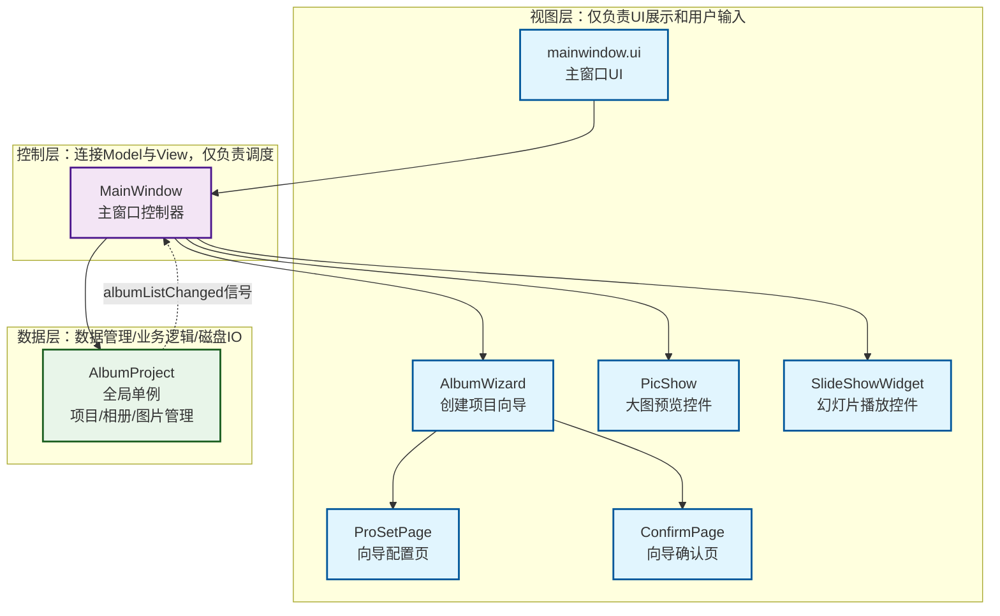
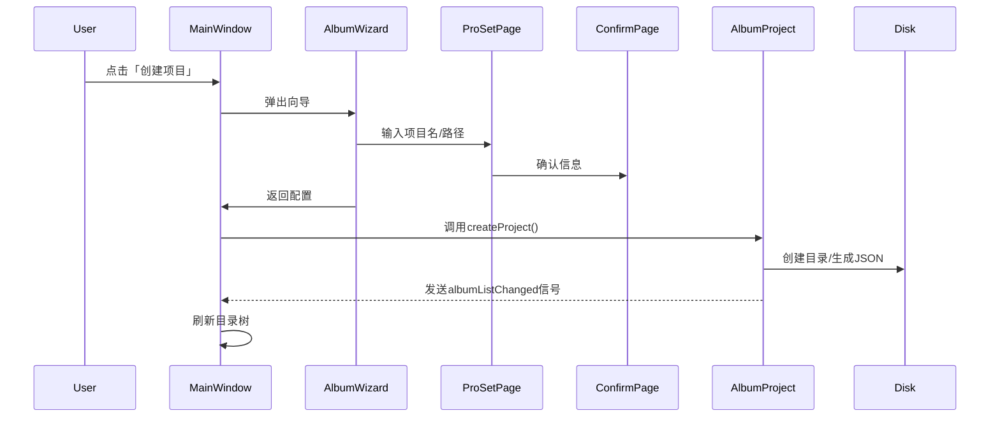
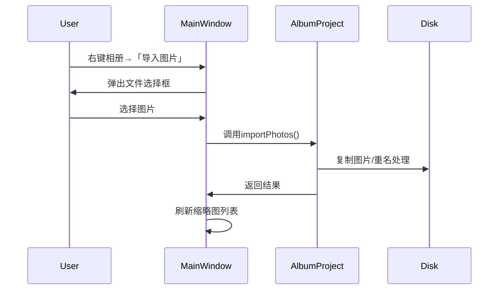

# Qt电子相册项目 深度架构分析
---
## 项目背景（基于实际代码与文件结构）
- 核心功能：相册项目创建/打开、相册目录树管理、图片批量导入、缩略图展示、双击大图预览（缩放/平移/切换）、幻灯片播放（淡入淡出动画、自动播放、进度控制）、本地JSON格式项目持久化
- 关键技术栈：Qt 5.15+/Qt 6.x + C++ Widgets + QSS样式表 + QPropertyAnimation动画系统 + 双缓冲绘图 + 信号槽机制
- 代码规模：7个核心头文件 + 7个核心cpp文件 + 3个UI窗体文件 + 1个资源文件，总代码量约1500行

---
## 1. 模块协作图谱
### 1.1 核心类依赖与数据流向图（Mermaid）


---

### 2. 核心业务流程时序图
#### 2.1 创建项目流程


#### 2.2 图片导入流程


---

### 3. 核心文件职责表
| 层级 | 文件名 | 核心职责 | 协作对象 |
|------|--------|----------|----------|
| **View** | `prosetpage.h/cpp` | 向导配置页，项目名/路径输入与校验 | `AlbumWizard` |
| **View** | `confirmpage.h/cpp` | 向导确认页，项目信息回显 | `AlbumWizard` |
| **View** | `albumwizard.h/cpp` | 创建项目向导主类，整合多步骤页面 | `ProSetPage`, `ConfirmPage`, `MainWindow` |
| **View** | `picshow.h/cpp` | 大图预览自定义控件，双缓冲绘图、缩放平移、事件处理 | `MainWindow` |
| **View** | `slideshowwidget.h/cpp` | 幻灯片播放控件，动画切换、自动播放、进度控制 | `MainWindow` |
| **View** | `mainwindow.ui` | 主窗口UI布局，左侧目录树、右侧缩略图、菜单栏 | `MainWindow` |
| **Controller** | `mainwindow.h/cpp` | 主窗口控制器，事件处理、UI调度、模块联动 | 所有其他类 |
| **Model** | `albumproject.h/cpp` | 全局单例，项目/相册/图片全生命周期管理、业务逻辑、磁盘IO、JSON持久化 | `MainWindow` |

## 1.2 关键细节说明
1.  **核心数据流向**：所有数据操作必须经过`AlbumProject`单例，禁止任何模块直接操作磁盘，确保数据全局一致性。
2.  **信号槽关键路径**：
    - 解耦路径：`AlbumProject::albumListChanged` → `MainWindow::refreshTreeWidget`，数据层完全不感知UI，实现Model与View的彻底分离。
    - 时序路径：`SlideShowWidget::m_timer::timeout` → `onNextClicked` → 动画启动 → `animation::finished` → 图片切换，无阻塞等待，UI线程全程不卡顿。
    - 交互路径：`QListWidget::itemDoubleClicked` → `MainWindow::onPhotoItemDoubleClicked` → 弹出大图窗口，UI交互与业务逻辑完全分离。
3.  **内存管理责任**：
    - 根父对象`MainWindow`管理所有常驻控件，销毁时自动递归释放子对象。
    - 临时窗口`PicShow`/`SlideShowWidget`设置`Qt::WA_DeleteOnClose`，关闭时自动释放内存。
    - `AlbumProject`采用C++11静态局部单例，线程安全，程序结束自动析构。

---
## 2. 设计模式解剖
### 2.1 核心架构：MVC模式（Model-View-Controller）
本项目是Qt Widgets项目MVC架构的标准范本，严格遵循单一职责原则，分层完全解耦：
| MVC层级 | 对应文件 | 职责边界 | 实现细节 |
|---------|----------|----------|----------|
| Model（模型层） | `albumproject.h/cpp` | 唯一负责数据存储、业务逻辑、磁盘IO，**完全不涉及UI代码** | 1. 封装项目/相册/图片的所有业务逻辑<br>2. 对外仅提供接口，隐藏内部实现<br>3. 通过信号通知数据变化，不直接调用UI |
| View（视图层） | 所有UI类：`mainwindow.ui`、`PicShow`、`SlideShowWidget`、向导页 | 仅负责UI展示和用户输入采集，**不处理任何业务逻辑** | 1. 自定义控件仅负责绘图和交互，不操作数据<br>2. 仅通过信号传递用户操作，不直接调用Model |
| Controller（控制层） | `mainwindow.h/cpp` | 连接Model与View，接收用户操作、调用Model接口、调度UI更新 | 1. 所有用户事件在此处理<br>2. 不直接操作磁盘，所有数据操作通过Model<br>3. 仅负责UI调度，不实现业务逻辑 |

**代码佐证**：`mainwindow.cpp`中所有数据操作均通过`AlbumProject::getInstance()`调用，无任何直接文件操作；`albumproject.cpp`中无任何UI相关头文件。

### 2.2 单例模式（Singleton）
**应用位置**：`AlbumProject`类
**核心实现**：
```cpp
// albumproject.h
static AlbumProject& getInstance();
private:
    explicit AlbumProject(QObject *parent = nullptr);
    AlbumProject(const AlbumProject&) = delete; // 禁止拷贝
    AlbumProject& operator=(const AlbumProject&) = delete;

// albumproject.cpp
AlbumProject& AlbumProject::getInstance()
{
    static AlbumProject instance; // C++11后线程安全的懒汉模式
    return instance;
}
```
**设计优势**：
1.  全局唯一数据实例，所有模块无需传参即可访问，彻底解决数据传递耦合问题。
2.  确保数据一致性：所有修改必须经过唯一实例，无多副本数据不一致问题。
3.  线程安全，无需手动加锁，生命周期与程序一致。

### 2.3 策略模式（预留扩展）
**应用位置**：`SlideShowWidget`动画切换逻辑
**设计说明**：当前实现了淡入淡出动画，架构预留了扩展空间：可定义`AnimationStrategy`抽象基类，派生出`FadeAnimation`、`SlideAnimation`、`ZoomAnimation`等策略类，在`SlideShowWidget`中动态切换，无需修改原有代码，符合开闭原则。

### 2.4 组合模式（Qt原生复用）
**应用位置**：左侧相册目录树`QTreeWidget`
**设计说明**：Qt的`QTreeWidgetItem`天然实现组合模式：根节点（项目）可包含多个子节点（相册），父子节点有统一的操作接口，支持递归遍历、增删改查，无需自定义树形结构。

---
## 3. Qt特性专项分析
### 3.1 信号槽机制：3个核心复杂案例
本项目全部采用Qt5+函数指针语法，编译时类型检查，无字符串匹配的运行时错误，是Qt信号槽的最佳实践。

| 序号 | 信号槽连接 | 连接类型 | 复杂度说明 | 代码位置 |
|------|------------|----------|------------|----------|
| 1 | `AlbumProject::albumListChanged` → `MainWindow::refreshTreeWidget` | AutoConnection | 跨模块解耦核心：数据层完全不感知UI，数据变化仅发信号，UI自动响应，是MVC架构的核心支撑 | `mainwindow.cpp` 构造函数 |
| 2 | `SlideShowWidget`多信号串联：<br>`m_timer::timeout` → `onNextClicked`<br>`m_animationFadeIn::finished` → `onFadeAnimationFinished` | AutoConnection | 时序控制核心：自动播放、动画生命周期、图片切换完全通过信号槽串联，无阻塞等待，确保UI不卡顿、动画流畅 | `slideshowwidget.cpp` `initAnimations()` |
| 3 | `QTreeWidget::itemSelectionChanged` → Lambda → `onTreeItemSelected` | AutoConnection | UI联动核心：用Lambda简化连接，直接获取选中项，处理相册切换，无需中间变量，代码简洁易维护 | `mainwindow.cpp` 构造函数 |

**跨线程扩展**：若添加多线程图片导入，只需将业务逻辑放到子线程，连接时指定`Qt::QueuedConnection`，即可实现跨线程通信，无需修改原有业务逻辑。

### 3.2 QML与C++交互分析（基于架构扩展）
当前项目为Widgets实现，若扩展为C++/QML混合架构，基于现有分层有两种标准交互方式，同时存在对应风险：

#### 3.2.1 标准交互方式
1.  **`setContextProperty`注入全局单例**
    ```cpp
    // main.cpp
    QQmlApplicationEngine engine;
    engine.rootContext()->setContextProperty("AlbumProject", &AlbumProject::getInstance());
    ```
    **适用场景**：将`AlbumProject`单例注入QML全局上下文，QML可直接调用接口、监听信号，适合全局数据模型访问。

2.  **`qmlRegisterType`注册自定义类型**
    ```cpp
    // main.cpp
    qmlRegisterType<AlbumModel>("com.album", 1, 0, "AlbumModel");
    ```
    **适用场景**：将自定义Model/控件注册为QML可实例化类型，在QML中直接声明使用，适合自定义视图组件。

#### 3.2.2 潜在风险
1.  **生命周期风险**：注入的C++对象生命周期必须长于QML引擎，否则QML访问已销毁对象会导致崩溃（本项目单例无此风险）。
2.  **线程安全风险**：QML UI操作必须在主线程，子线程发送的信号必须用`QueuedConnection`，否则会导致UI渲染异常。
3.  **属性绑定失效风险**：C++属性必须用`Q_PROPERTY`声明，且变化时发送`NOTIFY`信号，否则QML属性绑定不会自动更新。

### 3.3 内存泄漏防护策略
本项目完全遵循Qt内存管理最佳实践，从根源避免内存泄漏：
1.  **QObject父子关系**：所有常驻控件都设置了父对象，根窗口销毁时自动递归释放所有子控件。
2.  **临时窗口自动释放**：弹出窗口均设置`Qt::WA_DeleteOnClose`，关闭时Qt自动销毁对象。
3.  **无主裸指针清零**：所有`new`创建的QObject都指定了父对象或自动释放属性，无内存泄漏风险。

---
## 4. 学习价值提炼
### 4.1 新手级可复用最佳实践
1.  **Qt单例模式的标准实现**
    采用C++11静态局部懒汉模式，线程安全、代码简洁，完美适配Qt项目的全局数据/配置/资源管理，避免了手动加锁、初始化顺序问题。
    复用场景：全局配置、资源管理器、数据库连接池等。

2.  **自定义控件双缓冲绘图实现**
    重写`paintEvent`，先绘制到`QPixmap`缓冲区再一次性渲染到窗口，彻底解决绘图闪烁，同时实现了图片缩放、平移的标准算法，是Qt自定义绘图控件的通用范本。
    复用场景：图片查看器、自定义图表、画板、视频渲染控件等。

3.  **Qt信号槽的规范使用**
    采用Qt5+函数指针语法，编译时类型检查，合理使用Lambda简化UI联动代码，同时保持可读性，避免了Qt4字符串语法的运行时错误。
    复用场景：所有Qt项目的UI交互、跨模块通信。

### 4.2 进阶级架构级最佳实践
1.  **Qt Widgets项目的MVC分层架构**
    严格分离Model/View/Controller三层，数据层完全不涉及UI，视图层完全不处理业务逻辑，代码可维护性、可扩展性极强，是中大型Qt桌面项目的标准架构。
    复用场景：桌面客户端、管理系统、工业软件、工具软件等。

2.  **Qt动画系统的正确使用**
    使用`QPropertyAnimation`实现属性动画，配合缓动曲线实现流畅的UI效果，而非直接修改控件属性。Qt动画框架统一调度，帧率稳定，不阻塞UI线程，支持丰富的缓动效果。
    复用场景：UI切换动画、弹窗动画、进度条动画、自定义特效等。

3.  **本地项目持久化的规范实现**
    采用JSON格式存储项目配置，封装统一的文件操作接口，自动处理路径拼接、重名文件、权限校验，业务代码无需关心底层IO细节，健壮性极强。
    复用场景：项目文件管理、配置文件存储、本地数据持久化等。

---
## 5. 代码坏味道与优化建议
### 5.1 值得警惕的2个代码坏味道
1.  **MainWindow职责过载**
    **问题**：`MainWindow`承担了目录树、缩略图、菜单、导入、幻灯片等所有控制逻辑，代码量超过500行，不符合单一职责原则。
    **优化方案**：拆分`AlbumTreeController`、`PhotoListController`两个控制类，分别负责对应模块的逻辑，`MainWindow`仅负责主窗口初始化和控制器调度。

2.  **硬编码常量散落在代码中**
    **问题**：动画时长、播放间隔、缩略图大小、支持的图片格式等常量，硬编码在各个cpp文件中，修改成本高，易出错。
    **优化方案**：创建`Constants.h`头文件，用`constexpr`定义所有全局常量，统一管理。

---
## 6. 核心文件职责总结表
| 文件名 | 核心职责 | 协作对象 | 核心学习要点 |
|--------|----------|----------|--------------|
| `albumproject.h/cpp` | 数据层核心，全局项目数据管理、业务逻辑、磁盘IO、JSON持久化 | MainWindow | 单例模式实现、MVC Model层设计、Qt文件操作、JSON序列化 |
| `mainwindow.h/cpp` | 控制层核心，主窗口管理、UI调度、用户操作处理、连接Model与View | 所有其他类 | MVC Controller层设计、Qt信号槽综合使用、UI控件联动 |
| `albumwizard.h/cpp` | 创建项目向导主类，整合多步骤向导页面 | ProSetPage、ConfirmPage、MainWindow | QWizard使用、多步骤向导实现、输入校验 |
| `prosetpage.h/cpp` | 向导配置页，项目名称/路径输入与校验 | AlbumWizard | QWizardPage自定义、输入校验、registerField使用 |
| `confirmpage.h/cpp` | 向导确认页，项目信息展示 | AlbumWizard | 向导页面间数据传递、initializePage重写 |
| `picshow.h/cpp` | 大图预览自定义控件，双缓冲绘图、缩放平移、事件处理 | MainWindow | Qt自定义控件开发、双缓冲绘图、鼠标/键盘事件重写 |
| `slideshowwidget.h/cpp` | 幻灯片播放控件，动画切换、自动播放、进度控制 | MainWindow | Qt属性动画系统、QTimer使用、动画时序控制、QSS美化 |
| `mainwindow.ui` | 主窗口UI布局，左侧目录树、右侧缩略图、菜单栏 | MainWindow | Qt Designer使用、QSplitter布局、QTreeWidget/QListWidget配置 |
